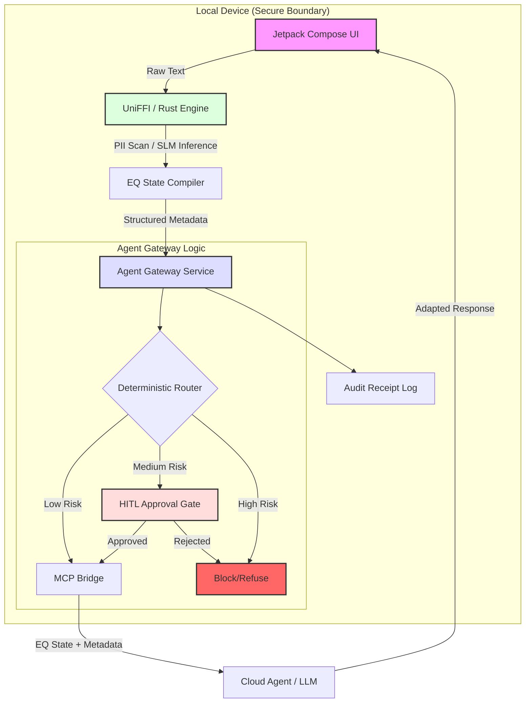

# Architecture Diagram: EQ Gateway Privacy Firewall

This diagram describes the data flow of a request through the EQ Gateway system.

## Mermaid.js Flow

## Data Flow Description

1. **Input Capture:** Raw text is captured in the Android UI and passed immediately to the Rust engine's `SecureBuffer`.
2. **Local Reduction:** The SLM processes the text locally to create an `EQ State` object (affect, intent, risk).
3. **Routing Decision:** The Agent Gateway applies a deterministic policy to the `EQ State`.
4. **Boundary Control:**
   - If **Blocked**, the request ends.
   - If **Local-First**, the agent is restricted to local tools.
   - If **Approval Required**, the request enters a LangGraph pause state until a human approves.
5. **MCP Transport:** Only the structured `EQ State` and approved excerpts cross the device boundary via the MCP Bridge.
6. **Auditability:** A JSON receipt is generated for every transaction, recording exactly what was sent and why.
